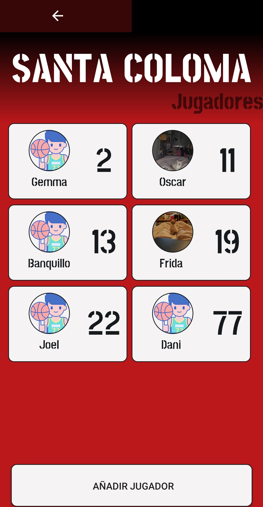
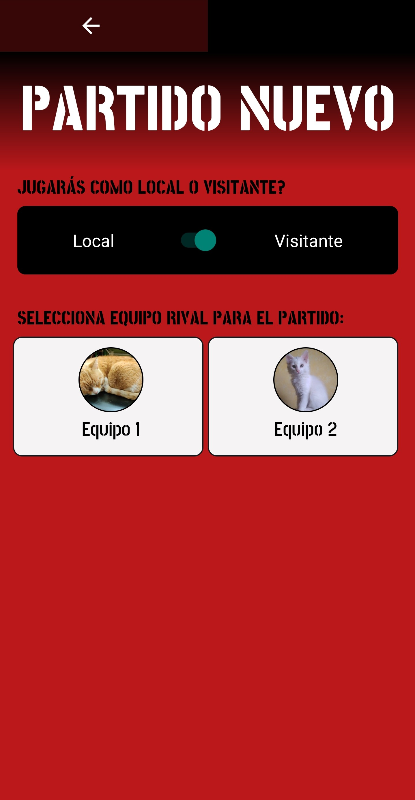
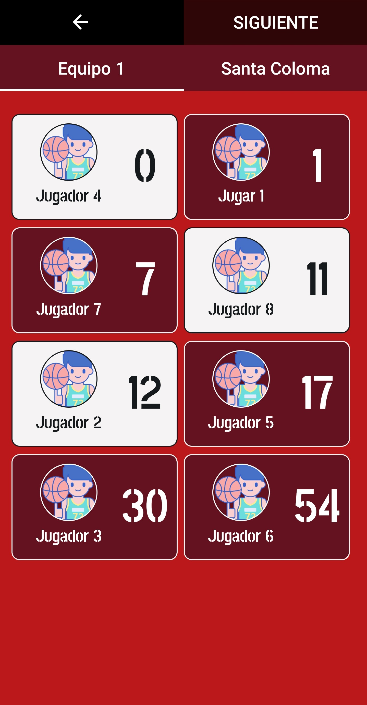
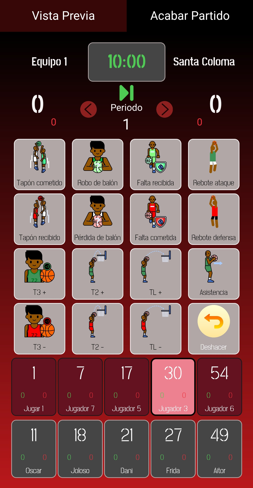
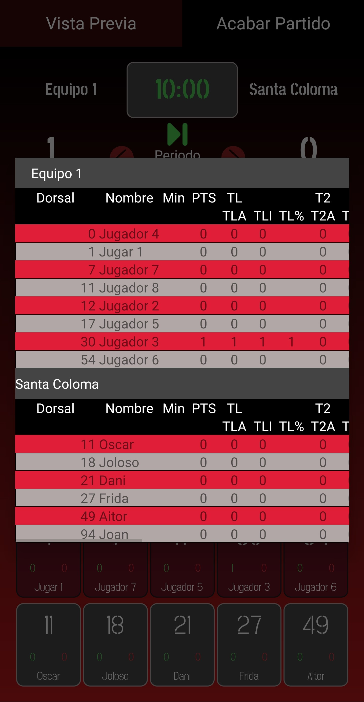
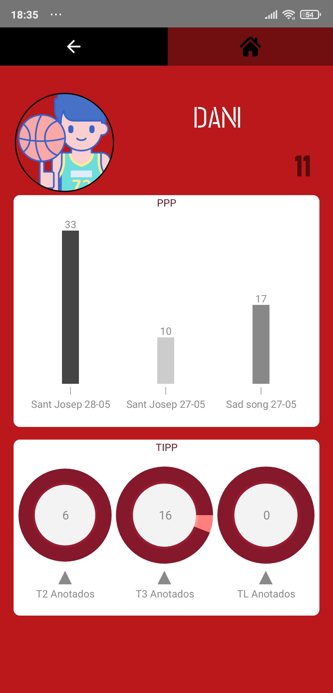
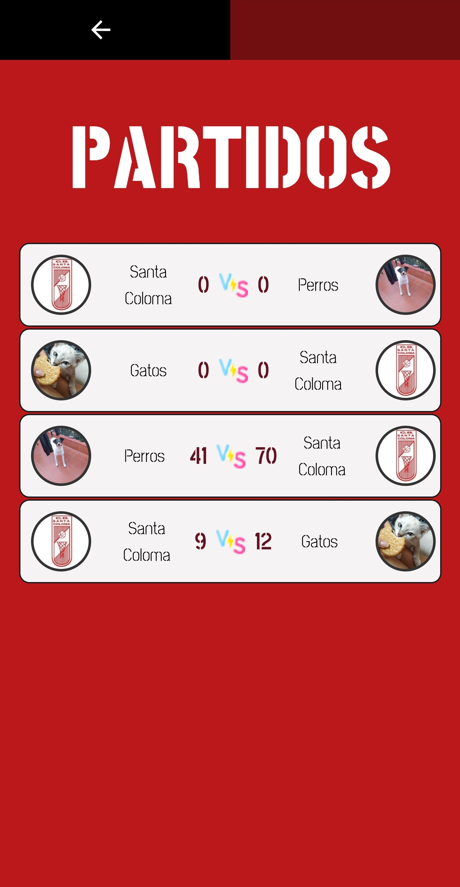
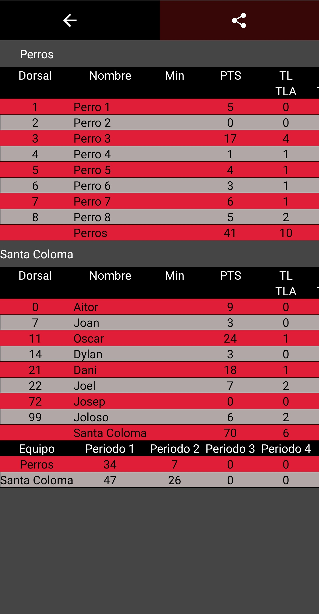
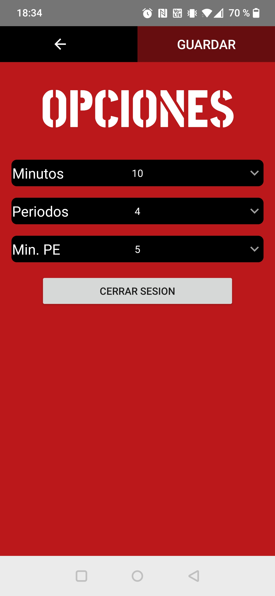

## **Descripción**

Stats On es un aplicación que recopila las estádisticas de un partido de baloncesto.
Esta enfocada para el club Santa Coloma de Gramanet pero se puede usar con cualquier equipo ya que se pueden crear
tantos como se quiera tanto en un ambiente profesional o amateur.
Con una interfaz simple e intuitiva podrás crear tus equipos, jugadores y partidos y tener todos los datos de tus partidos guardados
y a mano siempre que los necesites.

## **Manual de usuario**

- **Crear y borrar equipos**

    

    Para <b>crear equipos</b> deberas de acceder desde el menú principal a "Equipos rivales" por defecto mi equipo ya viene creado siendo el Santa Coloma de Gramenet.
    Una en la pantalla de equipos rivales deberas de presionar sobre "Añadir ". Esto le llevará a un pantalla donde se elegiria una imagen y un bombre para el nuevo equipo.
    Hecho esto presiona sobre el boton "Crear" que lo devolverá a la pantalla de los equipos rivales con su nuevo equipo ya creado.
    

    

        
        
    

   Para **eliminar equipos** deberá ir a la pantalla de equipos rivales y matener pulsado sobre ese equipo. Aparecerá un mensaje que dirá si está seguro de querer eliminar a ese equipo
   y confirmará para eliminarlo.

    

        
    

- **Crear y borrar jugadores**

    

    Para <b>crear jugadores</b> en tu equipo o en el equipo rival deberas de acceder desde el menú principal a "Mi equipo" o ir a "Equipos rivales" y seleccionar un equipo rival ya creado.
    Una vez haya seleccionado su equipo o uno rival se verán los jugadores del equipo seleccionado si es que se han añadido algunos anteriormente. Una vez aquí para añadir un jugador presionara
    sobre el boton "Añadir jugador" que le llevara a un pantalla donde se elegiria una imagen, un nombre y un dorsal para el nuevo jugador. Hecho esto presiona sobre el boton "Crear" que lo devolverá
    a la pantalla del equipo con su nuevo jugador ya creado.
    

    

        
        
    

   

   Para <b>eliminar jugadores</b> deberá ir al equipo del jugador que quiera eliminar y matener pulsado sobre ese jugador. Aparecerá un mensaje que dirá si está seguro de querer eliminar a ese jugador
   y confirmara para eliminarlo.
   

    

        
    

- **Crear partido**

    

    Para <b>crear un partido</b> desde el menú pricipal debe ir a "Partido nuevo". En la siguiente panta deberá elegir el equipo rival y si es local o visitante.
    A continuación elegirá los 5 jugadores titurales de su equipo y del equipo rival.
    

    

        
        
    

    

    Hecho esto llegará a la pantalla con la que interactuará para rellenar las estadistícas del partido. Para empezar el partido deberá presionar el boton play/pause que esta ubicado
    debajo de tiempo este botón iniciará y parará el tiempo para cuando comienze el partido y los tiempo muertos.
    Para que un jugar haga una de las 16 acciones disponibles se deberaá seleccionar a ese jugardor y luego la acción deseada. Los botones de las acciones son intuitivos ya que hacen lo que
    su nombre indica exepto el botón "Deshacer" que se utilizará para deseleccionar un jugar presionador por error para poder seleccionar otro. Para realizar un cambio de jugadores deberá
    de manter presionar sobre el jugar que desea cambiar. Si hace esto aparecera una pantalla y deberá elegir el jugador que quiera que salga a jugar. Por último en esta pantalla tenemos
    el boton de "Vista previa" que mostrará una tabla con las estadísticas del partido a tiempo real.
    

    

        
        
        
    

- **Consulta de datos**

    

    Para <b>consultar los datos de lo jugadores</b> desde el menú pricipal debe ir a "Mi equipo" o "Equipos rivales". Seleccionaremos el equipo deseado y seguidamente al jugador deseado. Esto lo llevará
    a un pantalla con las estadísticas del jugador seleccionado.
    

     

        
     

    

    Para <b>consultar los datos de lo partidos</b> desde el menú pricipal debe ir a "Partidos". Lo llevará a una pantalla con el listado de todos los partidos realizados.
    Seleccionaremos el partido deseado y esto lo llevará a un pantalla con una tabla de las estadísticas del partido seleccionado donde también puede compartir un archivo csv
    con los datos del partido o descargarlo através del enlance.
    

    

        
        
    

- **Opciones y cerrar sesión**

    

    Para <b>cambiar las opciones</b> y <b>cerrar sesión</b> desde el menú pricipal debe ir a "Opciones". Lo llevará a una pantalla donde podrá <b>cambiar los minutos del partido, el número de periodos y los minutos
    de la porroga</b>. También podra cerrar sesión con el boton "Cerrar sesión".
    

    

        
    

## Descarga la aplicación
[Descarga directa](statson.apk)
